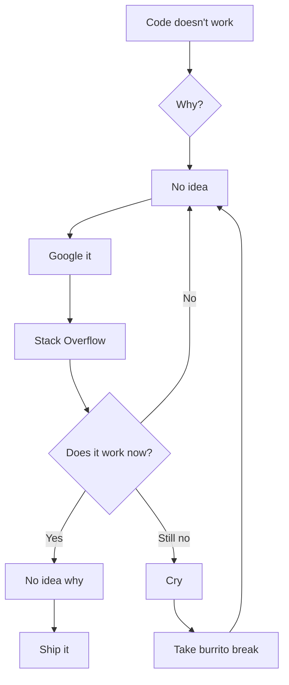

<p align="center">
<h1 height="200px" align="center">Hello hiiiiii, I'm Naoki </h1>
</p>
<p align="center">

### Founding Engineer @ Meisei | Silicon Design | Open-Source Hardware person
### aka Miyamii | Pluto | Tomoko | Nakamura | Saito
(Use dark mode to see the game)

<div align="center">
  
</div>


- I'm currently working on **scaling from 130nm to 45nm node** at **Meisei**.

- I'm highly interested in **processor design, my series of programs, and fish** 

- All of my projects are available at [https://github.com/Plutomaster28](https://github.com/Plutomaster28)

- Fun fact: **I can devour an entire burrito in 2 minutes**

**Projects:**
- I'll populate this list once I make a formal list of all the shit I'm juggling

<sub>*Basically proud of all the stuff I make tbh*</sub>

---

##  Current Status
```diff
+ Designing silicon like it's 2026 (because it is)
+ Converting caffeine to RTL at optimal efficiency
! Warning: May randomly talk about fish for extended periods
- Sleep schedule: NULL
- Unread emails: ∞
+ Vim exit attempts: Still trying
```

##  WARNING LABELS

```
  CAUTION: May contain traces of working code
  Side effects include: Sudden fish facts, burrito cravings
  Do not operate heavy machinery while reading my commits
  Contents under pressure (deadlines)
  Professional yapper - will explain entire CPU pipeline unprompted
```

---

# Statistics

[](#)
<!-- [](#) -->
[](#)
<!-- [](#) -->


<br clear="both"/>

---

#  Achievement Unlocked

<div align="center">


</div>

---

##  Totally Real™ Statistics

<div align="center">

| Metric | Value | Status |
|--------|-------|--------|
|  Burritos Consumed While Coding | ∞ | Healthy |
|  Fish Facts Known | 847 | Growing |
|  Lines of Verilog Written | Too Many | Send Help |
|  Hours of Sleep | `ERROR: Division by zero` | Critical |
|  Bugs Created vs Fixed | Yes | Balanced |
|  Commits at 3 AM | Most of them | Peak Performance |
|  Tabs vs Spaces | Violence | Justified |
|  Production Deployments on Friday | 0 | Learned My Lesson |
|  Stack Overflow Tabs Open | 47 | Normal |
|  Coffee to Code Ratio | 2:1 | Optimal |
|  "Quick Breaks" That Lasted 3 Hours | Too Many | No Regrets |

</div>

---

##  Random Dev Wisdom

<div align="center">

> *"It works on my machine"* - Famous last words before production

> *"130nm to 45nm isn't just a journey, it's a lifestyle"* - Me, probably

> *"Debug mode is just optimized panic"* - Ancient Silicon Proverb

> *"If it compiles on the first try, you're not pushing hard enough"* - Also me

> *"There are 10 types of people: those who understand binary and those who don't"* - Peak Comedy

> *"Git blame is just professional snitching"* - Unspoken Truth

> *"Comments are just future me calling past me an idiot"* - Hindsight 20/20

</div>

---

##  Current Quests

- [ ] Make silicon go brrrr faster
- [ ] Convince people that fish are cool
- [x] Establish burrito speedrun world record (unverified)
- [ ] Achieve photosynthesis to replace sleep
- [x] Create projects with cool names
- [ ] Touch grass (pending)
- [ ] Fix that one bug (it's been 6 months)
- [x] Overcomplicate a simple feature
- [ ] Understand my own code from 2 weeks ago
- [ ] Resist urge to rewrite everything from scratch
- [x] Argue about semicolons in a language that doesn't use them
- [ ] Actually read the documentation (unlikely)

---

##  Vibe Check

```
Energy Level:      [████████░░] 80% (Fueled by Monster)
Motivation:        [██████████] 100% (Projects are sick)
Sanity:            [███░░░░░░░] 30% (Acceptable for engineering)
Code Quality:      [████████░░] 85% (Gets the job done)
Meme Knowledge:    [██████████] ∞% (Chronically Online)
Imposter Syndrome: [██████████] 100% (Despite making sick projects)
Tab Hoarding:      [████████░░] 83 Chrome tabs (Under control)
Procrastination:   [████████░░] 80% ("I work better under pressure")
```

---

##  Totally Normal Developer Things I Do

<div align="center">

- Explaining complex CPU architectures to my fish (they don't get it)
- Writing commit messages like poetry (sometimes haiku)
- Naming variables after food because I'm hungry
- Talking to rubber ducks (they're great listeners)
- Celebrating when code works without knowing why
- Using `console.log()` for debugging like a caveman (it works)
- Having existential crises over naming conventions
- Building features nobody asked for (they're cool though)

</div>

---

##  Debugging Process



---

<div align="center">

##  Random Fish Fact Generator

<div align="center">

**Did you know?**
> The Pacific barreleye fish has a transparent head so it can see through its own skull.
> Yes, this is relevant to silicon design. No, I will not explain how.

*Refresh the page for more fish facts (jk there's only one but you fell for it)*

</div>

---

###  Contact & Socials
*Hit me up if you wanna talk silicon, fish, or why burritos are the optimal engineering fuel*


<div align="center">

###  Current Mood:


</div>

---

**Remember:** *Code is temporary, but the friends we segfaulted along the way are forever*  

<sub>Disclaimer: No actual silicon was harmed in the making of this profile. The fish are doing great. Burritos were definitely harmed.</sub> 

</div>
